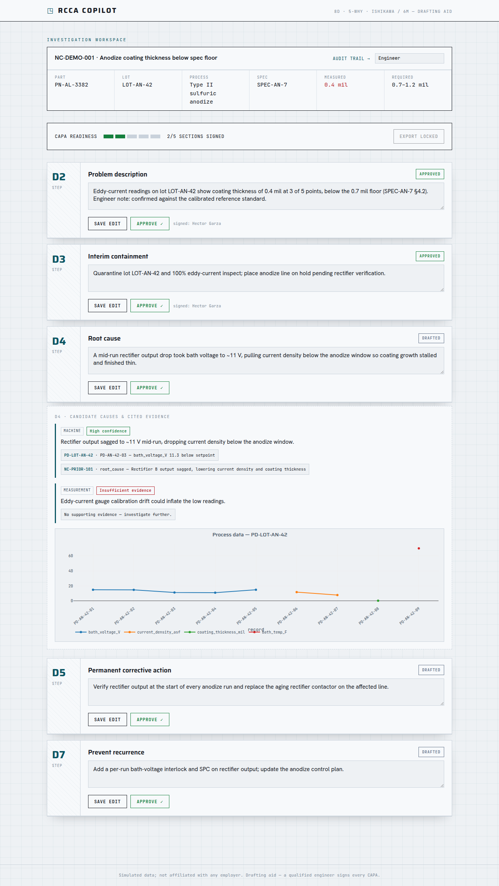
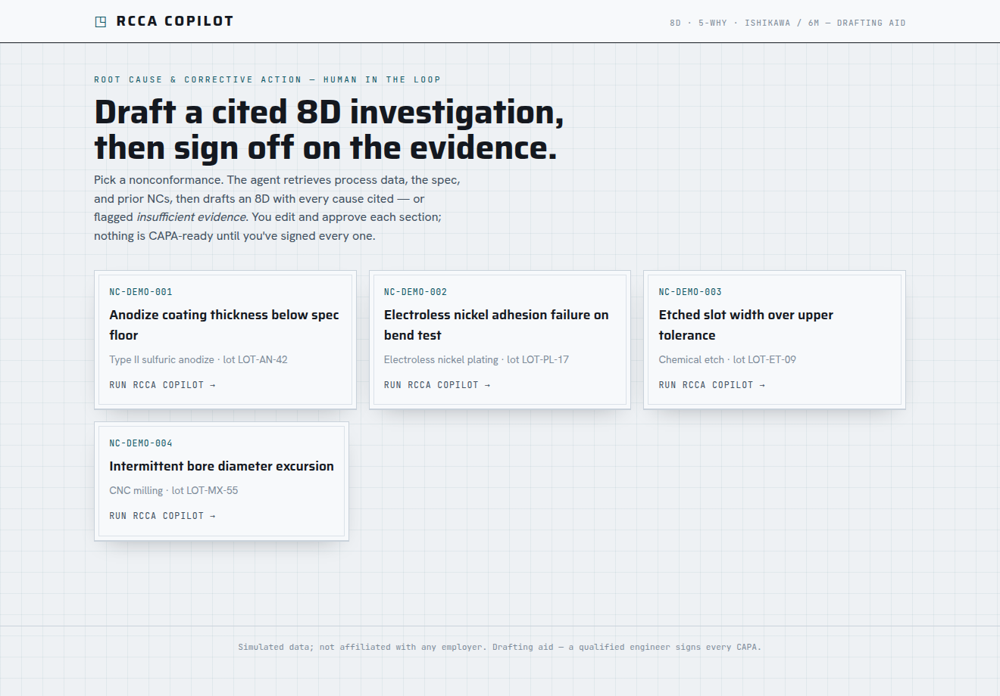
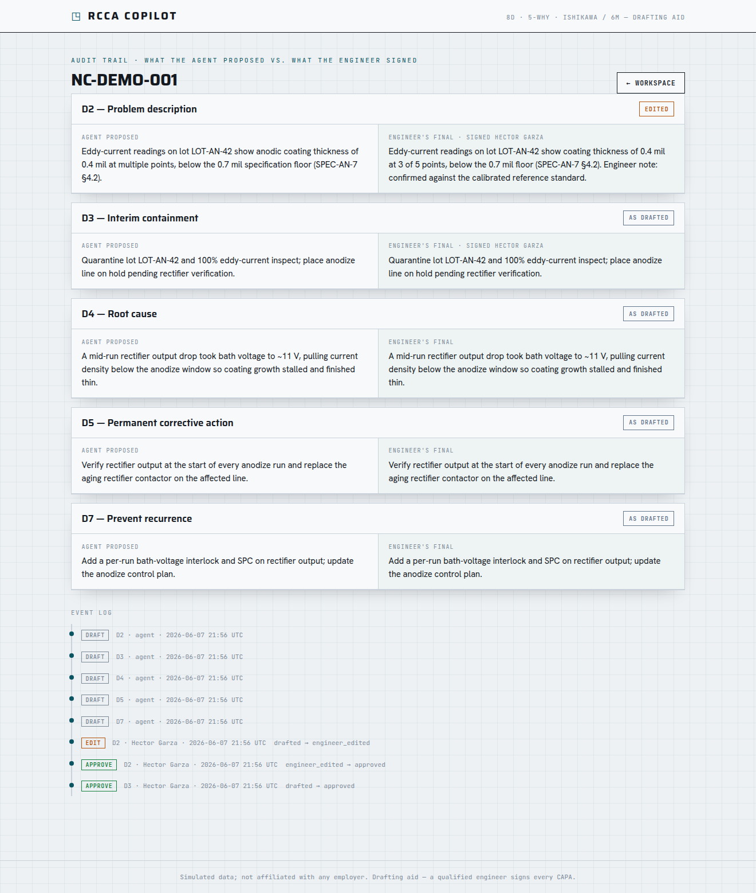
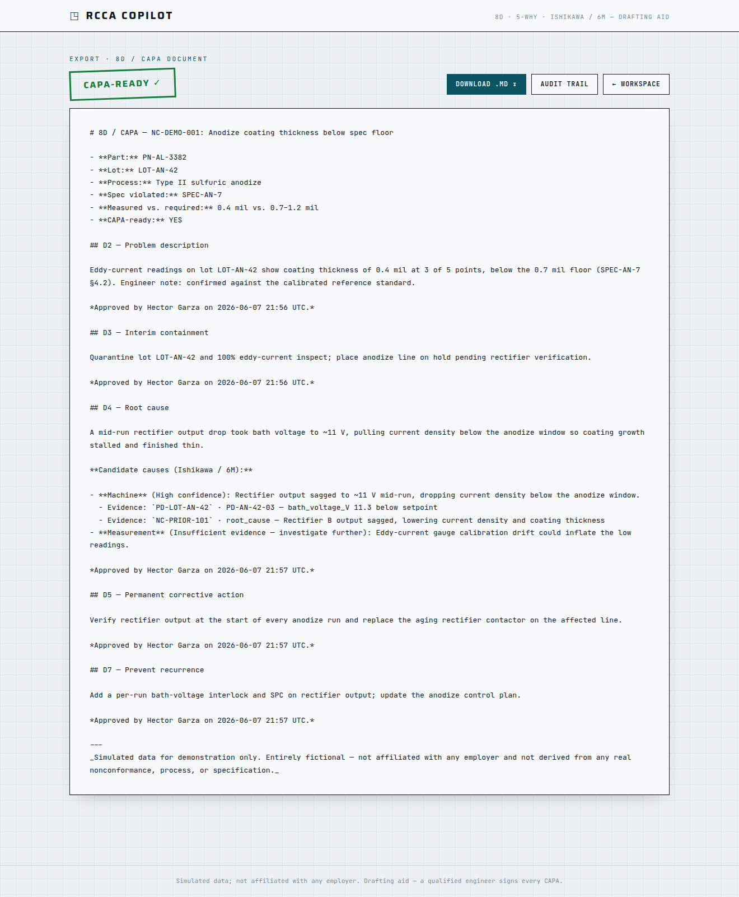

# RCCA Copilot

An AI agent that drafts a structured root-cause-and-corrective-action (8D / 5-Why) investigation from a manufacturing nonconformance — built so the engineer stays the decider and **nothing reaches a CAPA without human sign-off**.

**▶ Live demo: [rcca.hector-garza.com](https://rcca.hector-garza.com)**

> **Illustrative tool on synthetic data — not a quality system of record. A qualified engineer signs every CAPA.**

Part of [hector-garza.com](https://hector-garza.com)'s portfolio. One of **three deliverables of equal weight**: the app, a **Decision Record** ([`DECISIONS.md`](./DECISIONS.md)), and a recorded whiteboard session. A working demo no longer proves competence — the judgment behind it does. See [`SPEC.md`](./SPEC.md) §0.



## The thesis

Anyone can wrap an LLM in a form. The hireable signal is **how the human's role was designed** — what the agent is allowed to do, what it is deliberately *withheld* from doing, and the failure mode engineered against:

- **No autonomous filing — ever.** The agent drafts; it never closes a CAPA.
- **Grounding is enforced in code, not just prompted.** Every candidate cause cites tool-retrieved evidence *or* is flagged *insufficient evidence* — the agent is structurally unable to assert an uncited root cause (`enforce_grounding`).
- **A sign-off gate that can't be forced.** `is_capa_ready` is a derived property with no setter; export is blocked until every section is `Approved`.
- **An audit trail whose diff is the evidence of human judgment** — the agent's proposal vs. the engineer's final text, per section, plus who signed and when.

The killer risk it's built against: a confident, plausible, **wrong** root cause that reads well, sails into a CAPA, and lets the real defect recur.

## What it does

Pick a nonconformance → the agent retrieves process data, the spec, and prior NCs **via tools** (fetch, not recall) → drafts the **8D skeleton** (D2 problem, D3 containment, D4 root cause via **5-Why + Ishikawa/6M**, D5 corrective action, D7 prevent-recurrence) with every cause cited and a confidence level → the engineer edits and **approves** each section → export a clean 8D / CAPA document with the approver of record. Export unlocks **only** when every section is signed.

| Pick a sample | Edit & approve, see the cited evidence | Audit trail | Export |
|---|---|---|---|
|  |  |  |  |

## Tech stack

- **Backend:** Django 5 + Postgres
- **AI:** Anthropic SDK (Claude Opus 4.8) — tool-use retrieval, structured 8D outputs, grounding/citations, prompt caching (model-agnostic via `RCCA_MODEL`)
- **Frontend:** Django templates + HTMX + Plotly
- **Packaging:** Docker · **Quality:** pytest + ruff + GitHub Actions CI

## Run it locally (one command)

```bash
cp .env.example .env          # add your ANTHROPIC_API_KEY (only needed to run the agent)
docker compose up --build     # serves http://localhost:8000  (WEB_PORT=8001 if 8000 is taken)
```

Picking a sample runs the agent (needs `ANTHROPIC_API_KEY`). The state machine, corpus tools, export, and audit work without a key — see the tests.

```bash
docker compose exec web pytest -q       # full suite
docker compose exec web ruff check .    # lint
```

## Architecture

```
Browser — HTMX workspace (8D cards · Draft/Edit/Approve · evidence panel · Plotly · export gate)
   │
Django + Postgres
   ├── state.py        sign-off state machine (Drafted→Engineer-edited→Approved); is_capa_ready (derived)
   ├── models.py       NC · Investigation · Section · CandidateCause · EvidenceRef · AuditEvent
   ├── agent/          orchestrator (two-phase: tool-use gather → structured 8D emit) · grounding · tools · prompts
   ├── corpus/         synthetic NCs, process data, specs, prior NCs (stable IDs; planted causes as answer key)
   └── export.py       8D / CAPA Markdown renderer
```

Built **trust backbone first** (state machine + grounding), then the agent on top. Milestones M0→M7 in [`PLAN.md`](./PLAN.md); per-milestone design records under [`docs/superpowers/specs/`](./docs/superpowers/specs/).

## Deployment

Dockerized Django + Postgres on **Render**, fronted by **Cloudflare** (`rcca.hector-garza.com`). `ANTHROPIC_API_KEY` lives in host secrets — **never committed**. Cost-guarded: prompt caching, token caps, idempotent per-investigation agent runs. See [`DEPLOY.md`](./DEPLOY.md).

## Links

- 🔗 **Live demo: [rcca.hector-garza.com](https://rcca.hector-garza.com)** (Render free tier — first load may cold-start; picking a sample runs the live agent, ~10–30s)
- 🧠 Decision record: [`DECISIONS.md`](./DECISIONS.md)
- 🎥 Whiteboard walkthrough: _TBD_
